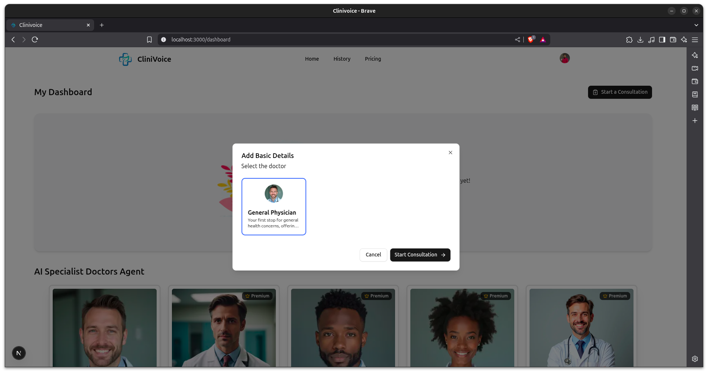

# CliniVoice 🩺🎤

**AI-Powered Medical Voice Assistant**

CliniVoice is an intelligent medical voice assistant built with Next.js that leverages cutting-edge artificial intelligence to provide voice-enabled healthcare support. This application combines modern web technologies with advanced AI models including OpenAI GPT-4.1 and Google Gemini 2.5 Flash, along with professional voice synthesis through Vapi and Assembly AI for accurate speech recognition.

<div align="center">
  
</div>

## 📸 Screenshots

<div align="center">
  
  
  
  
  
  
  
  
  
  
</div>
*Real-time voice conversation with medical AI assistant*

_Responsive design optimized for mobile devices_

## ✨ Features

- **🎙️ Voice Recognition**: Advanced speech-to-text powered by Assembly AI for accurate medical terminology recognition
- **🗣️ Voice Synthesis**: Professional voice generation using Vapi for natural conversational experience
- **🤖 Dual AI Processing**:
  - OpenAI GPT-4.1 for complex medical reasoning and analysis
  - Google Gemini 2.5 Flash for rapid response and real-time processing
- **💬 Conversational Interface**: Natural language processing for seamless communication
- **🔐 Secure Authentication**: User management and security powered by Clerk
- **📱 Responsive Design**: Optimized for desktop, tablet, and mobile devices
- **🔒 Privacy-Focused**: Secure handling of sensitive medical information
- **⚡ Real-time Processing**: Fast response times for immediate assistance
- **🌐 Modern Web Technologies**: Built with Next.js for optimal performance
- **💳 Payment Integration**: Secure payment processing via Stripe for premium features and subscriptions

## 🚀 Quick Start

### Prerequisites

Ensure you have the following installed on your system:

- Node.js (v18.0 or higher)
- npm, yarn, pnpm, or bun package manager

### Installation

1. **Clone the repository**

   ```bash
   git clone https://github.com/TaskmasterRishi/CliniVoice.git
   cd CliniVoice
   ```

2. **Install dependencies**

   ```bash
   npm install
   # or
   yarn install
   # or
   pnpm install
   # or
   bun install
   ```

3. **Set up environment variables**
<pre lang="markdown">
NEXT_PUBLIC_CLERK_PUBLISHABLE_KEY=<br>
CLERK_SECRET_KEY=<br>
NEXT_PUBLIC_CLERK_SIGN_IN_URL=/sign-in<br>
NEXT_PUBLIC_CLERK_SIGN_IN_FALLBACK_REDIRECT_URL=/ <br>
NEXT_PUBLIC_CLERK_SIGN_UP_URL=/sign-up<br>
NEXT_PUBLIC_CLERK_SIGN_UP_FALLBACK_REDIRECT_URL=/ <br>
NEXT_PUBLIC_CLERK_SIGN_IN_FALLBACK_REDIRECT_URL=/ <br>
OPEN_ROUTER_API_KEY=<br>
NEXT_PUBLIC_VAPI_PUBLIC_KEY=
</pre>


4. **Run the development server**

```bash
npm run dev
# or
yarn dev
# or
pnpm dev
# or
bun dev
```

5. **Open your browser**
   Navigate to [http://localhost:3000](http://localhost:3000) to see the application.

## 🛠️ Tech Stack

- **Frontend**: Next.js 14, React, TypeScript
- **Styling**: Tailwind CSS / CSS Modules
- **AI Models**:
  - OpenAI GPT-4.1 for advanced medical reasoning
  - Google Gemini 2.5 Flash for rapid response processing
- **Voice Technology**:
  - Vapi for voice generation and synthesis
  - Assembly AI for speech-to-text conversion
- **Authentication**: Clerk for secure user management
- **State Management**: React Context / Zustand
- **Database**: (Specify your database choice)
- **Payment Processing**: Stripe for secure transactions

## 🎯 Usage

### Basic Voice Interaction

1. Click the microphone button to start voice input
2. Speak your medical query or concern
3. Wait for AI processing and voice response
4. Continue the conversation naturally

### Example Interactions

- "What are the symptoms of flu?"
- "Can you help me understand my medication schedule?"
- "I have a headache, what should I do?"
- "Explain the side effects of this medication"

## ⚠️ Important Disclaimers

- **Not a Replacement for Professional Medical Advice**: CliniVoice is designed to provide general health information and should not replace consultation with qualified healthcare professionals.
- **Emergency Situations**: For medical emergencies, contact emergency services immediately.
- **Data Privacy**: All interactions are processed securely, but users should be mindful of sharing sensitive personal health information.

## 🔧 Configuration

### Customization

You can customize various aspects of CliniVoice:

- **AI Models**: Configure OpenAI GPT-4.1 and Gemini 2.5 Flash settings in `config/OpenAiModel`
- **Voice Settings**: Adjust Vapi voice synthesis and Assembly AI recognition parameters
- **Authentication**: Customize Clerk authentication flows and user management
- **UI Theme**: Update styling in `tailwind.config.js` or CSS files
- **Medical Knowledge Base**: Extend the knowledge base in `config/schema`

### Payment Integration

To set up Stripe payments:

1. Create a Stripe account at [stripe.com](https://stripe.com)
2. Add your Stripe API keys to `.env`
3. Install the Stripe SDK:
   ```bash
   npm install stripe @stripe/stripe-js
   ```
4. Configure the Stripe client in your application
5. Create payment components using Stripe Elements

Example usage:

```javascript
import { loadStripe } from "@stripe/stripe-js";

const stripePromise = loadStripe(
  process.env.NEXT_PUBLIC_STRIPE_PUBLISHABLE_KEY
);
```

For full implementation details, refer to the [Stripe documentation](https://stripe.com/docs).

## 🧪 Testing

Run the test suite:

```bash
npm run test
# or
yarn test
# or
pnpm test
```

For end-to-end testing:

```bash
npm run test:e2e
# or
yarn test:e2e
```

## 📦 Building for Production

1. **Build the application**

   ```bash
   npm run build
   # or
   yarn build
   # or
   pnpm build
   ```

2. **Start the production server**
   ```bash
   npm start
   # or
   yarn start
   # or
   pnpm start
   ```

## 🚀 Deployment

### Vercel (Recommended)

The easiest way to deploy CliniVoice is using [Vercel](https://vercel.com/new?utm_medium=default-template&filter=next.js&utm_source=create-next-app&utm_campaign=create-next-app-readme):

1. Connect your GitHub repository to Vercel
2. Configure environment variables in Vercel dashboard
3. Deploy automatically on every push to main branch

### Development Guidelines

- Follow TypeScript best practices
- Write comprehensive tests for new features
- Ensure accessibility compliance (WCAG 2.1)
- Update documentation for any API changes
- Follow the existing code style and formatting

## 🙏 Acknowledgments

- **Next.js Team** for the amazing framework
- **OpenAI** for GPT-4.1 advanced reasoning capabilities
- **Google** for Gemini 2.5 Flash rapid processing
- **Vapi** for professional voice synthesis technology
- **Assembly AI** for accurate speech recognition
- **Clerk** for seamless authentication solutions
- **Medical Community** for guidance on healthcare applications
- **Open Source Contributors** who make projects like this possible

## 📊 Project Status

- **Version**: 1.0.0
- **Status**: Active Development
- **Last Updated**: June 2025
- **Maintainer**: [@TaskmasterRishi](https://github.com/TaskmasterRishi)

---

**⚠️ Medical Disclaimer**: This application is for informational purposes only and is not intended to be a substitute for professional medical advice, diagnosis, or treatment. Always seek the advice of your physician or other qualified health provider with any questions you may have regarding a medical condition.

---

<div align="center">

**Built by TaskmasterRishi**

</div>
